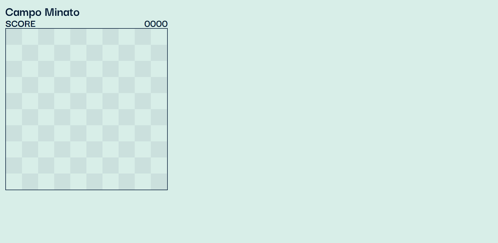
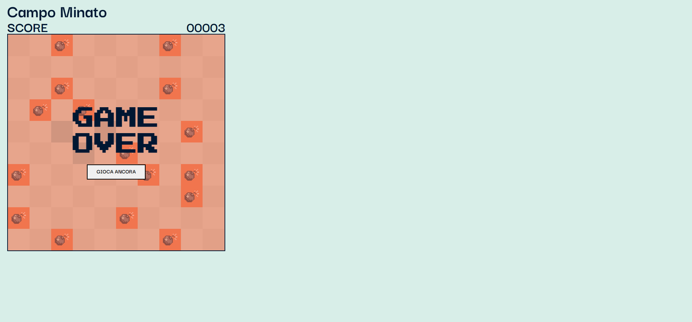

# E-commerce Web App 

Questo progetto è stato realizzato prendendo spunto dal gioco campo minato.

## Descrizione

Questo progetto permette all'utente di giocare al gioco campo minato. Le bombe sono posizionate in maniera random ad ogni aggiornamento della pagina in modo da fornire all'utente un'esperienza più divertente.

## Funzionalità

La web app include le seguenti funzionalità:

-Possibilità di giocare ogni volta in modo diverso
-Schermata hai vinto
-Schermata hai perso

## Tecnologie utilizzate

Il gioco è stato sviluppato utilizzando le seguenti tecnologie:

- HTML
- CSS
- JavaScript

## Licenza

<!-- Questo progetto è stato rilasciato sotto la licenza MIT. Per ulteriori informazioni, leggere il file `LICENSE.md`. -->

## Crediti

Questo progetto è stato sviluppato da Katia Falletti.(https://it.linkedin.com/in/katia-falletti-616890225?trk=people-guest_people_search-card)
